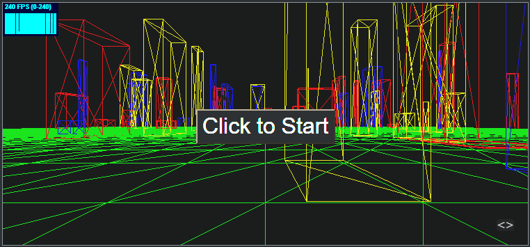
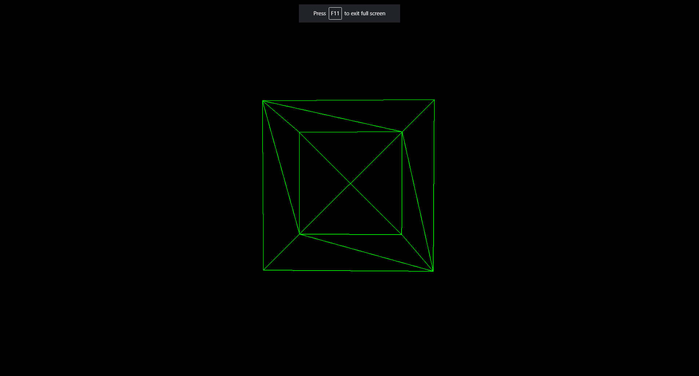

# PointerLock

- Fork and clone to your repos folder on your desktop
- Open in VS Code
- Run the app

## Run the following commands in the terminal of VS Code

- `npm install -g typescript` Install TypeScript globally
- `npm init` Initialize a new project with NPM
- `npm install three --save-dev` Install the Three.js library
- `npm install @types/three --save-dev` Install the Threejs type definitions
- `npm install webpack webpack-cli webpack-dev-server webpack-merge ts-loader --save-dev` install several modules for Webpack effectively
- `npm install typescript --save-dev` Install a local copy of TypeScript in the node_modules folder for use by the ts-loader
- `npm install dat.gui --save-dev` Install Dat.GUI manually from its official repository
- `npm install @types/dat.gui --save-dev` Install Dat.GUI Types manually from its official repository
